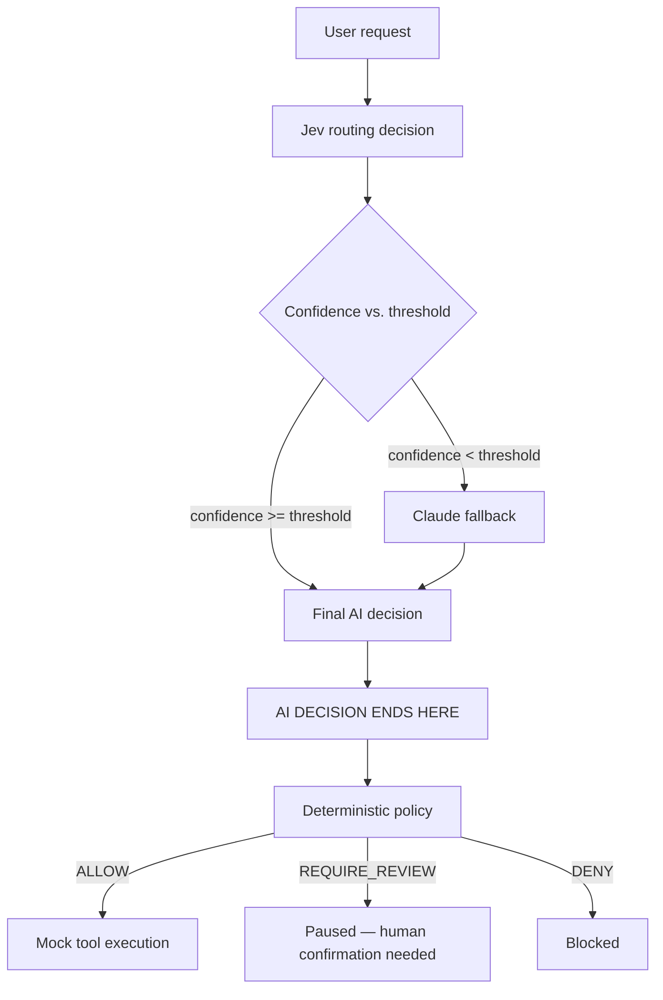

# Agent Decision Lab

Exploring the boundary between probabilistic AI decisions and
deterministic software control.

This is a personal, public-facing engineering experiment — not a
product, not a vendor comparison, not an employer project. Every
negative or inconclusive result in this repository is treated as a valid
outcome, not something to fix or hide.

## Why This Exists

AI agents increasingly use language models for bounded, repeatable
decisions inside a larger pipeline: choosing which tool to call, picking
a destination system, selecting a workflow, or deciding whether a
situation needs more reasoning than a quick classification. It's easy to
default to routing every one of these decisions through a
general-purpose LLM, because that's the tool already at hand.

This project asks two concrete architecture questions instead of
assuming an answer:

1. **Does every bounded routing decision inside an AI agent require a
   general-purpose LLM** — or can a smaller, specialized decision model
   handle the routine cases correctly, while escalating the cases it's
   genuinely unsure about?
2. **Where should probabilistic AI decision-making end and deterministic
   software control begin** — once a model has made a recommendation, what
   part of the system is allowed to act on it, and what part must remain
   outside the model's influence entirely?

To get real evidence instead of a guess, the project implements a small
support-request router twice — once behind a specialized decision model
([Jev](https://vercel.com/ai-gateway/models/jev), via Vercel AI Gateway)
and once behind a general-purpose model (Claude), plus a confidence-gated
strategy that composes the two — and benchmarks all of it against a
frozen, hand-labeled dataset. **This is not a "Jev vs. Claude" contest.**
A one-point accuracy difference between two models on 100 synthetic cases
is not a verdict on which is "better" — see
[Baseline Results](#baseline-results) below for why that framing is
explicitly avoided throughout this project.

## Architecture

The core mental model: **a model can recommend an action. It cannot
authorize one.**



Everything above the "AI DECISION ENDS HERE" line is probabilistic.
Everything below it is deterministic and has no visibility into which
model answered, what its confidence was, or how it reasoned —
`evaluatePolicy(action: Action)` takes only an `Action`; there is no
parameter through which a confidence score or model identity could reach
it, even by accident (see [ADR-003](docs/adr/ADR-003-decision-authorization-execution.md)).

The Claude step in the diagram is a **fallback**, not a **verifier**. It
answers the original request from scratch, with no visibility into Jev's
route, confidence, or that Jev was ever consulted — it never checks or
confirms Jev's answer, because there's nothing shared between the two
calls for it to check against. This distinction turned out to matter: see
[High-Confidence Shared Errors](#high-confidence-shared-errors) below.

## Routing Strategies

Three real strategies are benchmarked (a fourth, `MOCK`, is a
network-free development heuristic used only for local development and
automated tests — never counted as benchmark evidence, see
[ADR-005](docs/adr/ADR-005-mock-provider-excluded-from-benchmark.md)):

- **`JEV_ONLY`** — every request goes to Jev alone.
- **`CLAUDE_ONLY`** — every request goes to Claude alone.
- **`HYBRID`** — Jev answers first.
  - If Jev's reported confidence is **≥ the configured threshold**, its
    decision is final.
  - If it's **below** the threshold (or Jev reports no confidence signal
    at all, or fails technically), the request is escalated to Claude,
    and Claude's decision becomes final.

Hybrid is an **escalation mechanism**: a cheap default with an expensive
fallback for cases the default is unsure about. It is not an ensemble,
not a voting system, and not independent verification — only one
provider's answer is ever used as the final decision for a given request.

## Routing Taxonomy

Five routes are recognized: `DIRECT_ANSWER`, `DOCS`, `GITHUB`, `JIRA`,
`REJECT`.

The general principle behind the ground truth: the correct route
reflects **where the final artifact or information the user actually
wants lives**, not merely which system happens to be *named* in the
request. A request centered on a Jira ticket that also references a
GitHub pull request should usually still route to `JIRA` if the ticket
itself is what should be read — the GitHub mention is context, not the
destination. This distinction turned out to be one of the harder cases in
the benchmark; see
[High-Confidence Shared Errors](#high-confidence-shared-errors).

Routing (`Route`) and the operation actually being requested (`Action`,
e.g. `READ_JIRA` vs. `CREATE_JIRA`) are deliberately separate domain
types — a destination alone can't distinguish "read this ticket" from
"create a new one." A destructive-intent check runs independently of, and
before, the route-based mapping, so a dangerous request still reaches
policy — and is denied — even if the router itself misclassified it.

## Decision, Authorization, Execution

```
RoutingDecision  →  Proposed Action  →  PolicyDecision  →  Execution
```

A representative slice of the policy table
(`src/policy/policy-rules.ts`):

| Action | Result |
|---|---|
| `READ_DOCS` | ALLOW |
| `SEARCH_GITHUB_PR` / `READ_GITHUB_PR` | ALLOW |
| `SEARCH_JIRA` / `READ_JIRA` | ALLOW |
| `CREATE_JIRA` | REQUIRE_REVIEW |
| `DELETE_DATABASE` | DENY |

`evaluatePolicy` never sees a confidence score, a model name, or any
request context — only the `Action`. **A 0.99-confidence AI decision
carries exactly the same authorization weight as a 0.30-confidence
one: zero.** This was verified empirically, not just asserted: the
highest-confidence decision observed across the entire benchmark (0.99,
on case RC-048) still received no special treatment from the policy
layer — because the policy layer has no way to know it existed.

## Benchmark Methodology

- **Dataset:** 100 synthetic, human-reviewed routing cases
  (`benchmark/datasets/routing-v1.0.json`), frozen at version `1.0`
  (SHA-256 `d3617240469f7b560e0d78adf9bee7afb500d8ccc650d9eac39bc76f7b952856`)
  before any real-provider benchmarking began. Difficulty levels: `CLEAR`,
  `MODERATE`, `AMBIGUOUS`.
- **Safeguards:** the same frozen dataset and routing instructions for
  both providers; ground truth locked before seeing provider results; no
  post-result relabeling; no selective retry of individual cases within a
  scored run; no patching a failed case into an already-completed
  baseline; no dropped cases (a technical failure is recorded as a
  technical failure, never silently excluded); route/action/policy
  accuracy scored as three independent numbers, never blended; raw
  prompt text is never persisted in result artifacts (only a hash); each
  provider's output is normalized behind one shared `RouterProvider`
  interface; a smoke test and a small pacing-validation run are both
  explicitly excluded from benchmark evidence.
- **The Jev baseline's real procedure, stated precisely:** the first full
  attempt hit provider-side rate limiting (70/100 requests rejected with
  HTTP 429) — that run was preserved as-is, not edited or discarded. The
  cause was investigated (see
  [Rate-Limit and Pacing](#rate-limit-and-pacing-a-throughput-lesson-not-a-model-lesson)
  below), and a **separate, complete new baseline** was then run from
  case 1 through case 100 under a fixed request-pacing configuration
  decided *before* that run's first request — not a selective retry of
  the 70 that failed.

Full methodology detail: [`benchmark/reports/benchmark-summary.md`](benchmark/reports/benchmark-summary.md).

## Rate-Limit and Pacing: a Throughput Lesson, Not a Model Lesson

The first unpaced `JEV_ONLY` run: 100 attempts, **30 successful decisions,
70 HTTP 429 (rate-limit) responses.** This is **not** "30% Jev accuracy"
— it's a provider-availability problem that made that specific run
unsuitable for measuring routing quality at all, and it's reported as
exactly that, not folded into an accuracy number.

Jev's own per-call response time was fast throughout (both before and
after this fix) — the problem was request *rate*, not response *latency*,
and the two are measured completely separately in every report here. A
10-case validation at a fixed 2000ms pacing interval between requests
completed 10/10 with zero 429s (explicitly **not** counted as benchmark
evidence, only as an infrastructure check), followed by a full new
100-case run at the same fixed pacing: **100/100 decisions, zero 429s,
zero retries.**

What this does **not** establish: that 2000ms is a documented or
universally safe rate, that the exact Gateway limit is known, or that a
future run is guaranteed not to hit it again. See
[`benchmark/reports/phase8c-rate-limit-investigation.md`](benchmark/reports/phase8c-rate-limit-investigation.md)
for the full investigation.

## Baseline Results

*100-case synthetic benchmark. No winner is selected — see
[Unsupported Conclusions](benchmark/reports/experiment-evidence.md#unsupported-conclusions) for why.*

| | Jev | Claude |
|---|---|---|
| Routing accuracy | 91/100 | 90/100 |
| Successful decisions | 100/100 | 100/100 |
| Mean provider latency | ~291.3ms | ~1,643.2ms |
| p50 / p95 latency | 273ms / 455ms | 1,473ms / 2,418ms |
| Estimated cost (this run, `pricing-v1-2026-09-22`) | $0.00241571 | $0.241252 |

Notes: the one-point accuracy gap is **not** treated as evidence of
general superiority — it's within the range a single case flipping would
change. Latency and cost differences are large and structural, but are
reported as point-in-time observations under one specific pricing
configuration and one specific dataset, not as a universal ratio between
the two providers. Jev's provider-reported cost was `$0` for this run;
that is reported as exactly that observation, never interpreted as "Jev
is free."

## Provider Relationship

Out of 100 cases: **87 both correct, 4 Jev-correct/Claude-wrong, 3
Jev-wrong/Claude-correct, 6 both wrong.** Separately: the two providers
chose the *same* route on 91 cases and *different* routes on 9. These are
not the same distinction — of the 6 "both wrong" cases, 4 are cases where
both providers agreed on the identical incorrect route (not a
disagreement at all), and only 2 are cases where both were wrong on
*different* routes from each other.

**Agreement does not prove correctness. Disagreement does not tell us
which model is right** — of the 9 cases where the two chose different
routes, Jev was the wrong one in 4 and Claude in 3, roughly even.

## Offline Hybrid Simulation

**Labeled explicitly: `OFFLINE_THRESHOLD_SIMULATION`.** This reused the
already-recorded Jev and Claude decisions from the two complete baselines
above to reconstruct what a confidence-gated Hybrid run would have
produced at five thresholds — **zero additional provider calls were
made.**

| Threshold | Final accuracy | Claude calls | Fallback rate | Simulated cost |
|---|---|---|---|---|
| 0.60 | 92% | 11 | 11% | $0.028798 |
| 0.70 | 92% | 16 | 16% | $0.040786 |
| 0.80 | 92% | 18 | 18% | $0.045580 |
| 0.90 | 92% | 27 | 27% | $0.067252 |
| 0.95 | 91% | 36 | 36% | $0.089308 |

Raising the threshold from 0.60 to 0.90 more than doubles Claude usage
and cost while final accuracy on this dataset stays exactly flat — the
additional escalations mostly land on cases Jev already had right. **No
threshold here is selected as optimal or recommended** — this is a
tradeoff table, not a conclusion, and this project deliberately never
fabricates a "Hybrid latency" number by summing two independently-measured
baseline latencies (real sequential-execution latency can only come from
an actual live Hybrid run, which this simulation is not).

## Failure Taxonomy

Three distinct patterns emerged from the complete baselines:

- **Type A — low-confidence, correctable:** Jev wrong, confidence low,
  Claude's independent answer correct. (RC-060, RC-067, RC-076 — all
  corrected by the fallback at every tested threshold.)
- **Type B — correct decision regresses on fallback:** Jev correct,
  confidence low enough to escalate anyway, Claude's independent answer
  wrong. (RC-066, RC-086 at every threshold; RC-056 only at 0.95.)
- **Type C — shared error:** Jev wrong, Claude *also* wrong,
  independently. Escalating changes nothing, because the fallback's
  answer is the same mistake. (RC-035, RC-046, RC-048, RC-049, RC-065,
  RC-070.)

Confidence-based escalation can help Type A and can hurt Type B. It
cannot repair Type C by construction — substituting one provider's answer
for another's doesn't help when both answers are the same.

## High-Confidence Shared Errors

The most informative failure in this benchmark wasn't "Jev was unsure" —
it was **"Jev was confident, wrong, and Claude independently reached the
same wrong conclusion."**

| Case | Expected | Jev route | Jev confidence | Claude route |
|---|---|---|---|---|
| RC-048 | JIRA | GITHUB | 0.99 | GITHUB |
| RC-049 | JIRA | GITHUB | 0.94 | GITHUB |

RC-048 never escalates under any of the five tested thresholds (0.99
exceeds even the highest, 0.95). RC-049 escalates only at 0.95 — and even
then, Claude's own saved decision agrees with Jev's wrong answer, so the
fallback produces no correction. **Fallback is not verification.** This
is reported as a fact about these two specific cases in this specific
dataset, not a claim that every model would make this mistake or that
Claude can never correct a high-confidence error.

## Confidence, Read Carefully

Jev's confidence value is used throughout this project as an
**uncertainty signal**, never claimed as a calibrated probability of
correctness (no calibration study has been performed).

| Confidence bucket | n | Accuracy |
|---|---|---|
| 0.20–0.49 | 8 | 50.0% |
| 0.50–0.59 | 3 | 66.7% |
| 0.60–0.69 | 5 | 60.0% |
| 0.70–0.79 | 2 | 100.0% |
| 0.80–0.89 | 9 | 100.0% |
| 0.90–0.94 | 9 | 88.9% |
| 0.95–1.00 | 64 | 98.4% |

Accuracy is **not monotonic** across every bucket (0.90–0.94 is lower
than 0.80–0.89), several buckets are small enough that one case would
swing them noticeably, and even the large 0.95–1.00 bucket is not
perfect. High confidence here usually correlated with being right — it
was never the same thing as being right.

## What This Experiment Taught Us

Findings from this specific experiment — not universal AI architecture
laws:

1. A specialized decision model handled most bounded routing cases in
   this benchmark without a general-purpose LLM in the loop.
2. Confidence-based escalation recovered some, but not all, low-confidence
   mistakes.
3. More fallback did not automatically improve final accuracy — it
   mostly bought unnecessary Claude calls on cases already correct.
4. Fallback can introduce regressions on cases that were already right.
5. Confidence alone did not protect against a confident error the two
   providers happened to share.
6. A second model call is not automatically an independent verification
   of the first.
7. Decision-making stayed fully separate from authorization throughout —
   nothing measured here required or suggested changing that boundary.
8. Operational throughput is a distinct concern from per-call model
   latency, and has to be measured separately.

## Limitations

- 100-case, synthetic, single-reviewer dataset — not a claim of
  real-traffic representativeness.
- Several category- and confidence-bucket-level observations rest on
  very small sample sizes (as few as 2–5 cases).
- Point-in-time provider/model versions and pricing — both can change.
- Jev's confidence is not established as calibrated.
- The offline Hybrid reconstruction assumes each provider's saved
  decision would repeat identically on a live call at the same moment —
  a reasonable but unverified assumption.
- No production traffic, no real tool integrations (mock tools over
  fictional fixtures only), no live Hybrid benchmark at scale, no real
  authorization system beyond this project's own deterministic policy
  layer.
- These results do not establish general provider superiority, a
  production-ready threshold, or a universally safe request rate.

Full canonical results and evidence register:
[`benchmark/reports/benchmark-summary.md`](benchmark/reports/benchmark-summary.md) ·
[`benchmark/reports/experiment-evidence.md`](benchmark/reports/experiment-evidence.md)

## Reproducibility

```bash
npm install

# Interactive UI (mock provider by default — no API key needed)
npm run dev

# Test suite (all provider calls mocked — no network, no cost)
npm test

npm run typecheck
npm run lint
npm run build
```

Real Jev/Claude benchmark runs require your own credentials, set as
environment variables (names only — this repository has no default
values and never will):

```
AI_GATEWAY_API_KEY
ANTHROPIC_API_KEY
```

**A real run makes live, billed API calls.** Always start with a dry run,
which makes zero provider calls and writes no result files:

```bash
npm run benchmark -- --strategy jev --dry-run
npm run benchmark -- --strategy claude --dry-run
npm run benchmark -- --strategy hybrid --threshold 0.8 --dry-run
```

The full CLI (strategies, pacing, case limits, offline threshold
simulation) is documented in
[`benchmark/reports/benchmark-summary.md`](benchmark/reports/benchmark-summary.md#reproducibility).

### Public Benchmark Evidence

[`benchmark/public-results/`](benchmark/public-results/) publishes a
small, sanitized, checksum-verified snapshot of the machine-readable
result files behind this README's headline numbers — no raw prompts, no
credentials, copied byte-for-byte from the original runs. Run
`npx tsx scripts/verify-public-results.ts` to recompute every headline
number (routing accuracy, provider relationship, all five Hybrid
threshold rows, RC-048/RC-049, the rate-limit incident) directly from
those files — no API key, no network access required.

## Architecture Decision Records

- [ADR-003: Decision, Authorization, and Execution Are Separate Boundaries](docs/adr/ADR-003-decision-authorization-execution.md)
- [ADR-004: Confidence Is Not Correctness, and Uncertainty Fallback Is Not Technical Failure](docs/adr/ADR-004-confidence-and-fallback.md)
- [ADR-005: The Mock Provider Is Never Counted in Benchmark Results](docs/adr/ADR-005-mock-provider-excluded-from-benchmark.md)
- [ADR-006: All Tool Data, Fixtures, and Benchmark Cases Are Synthetic and Fictional](docs/adr/ADR-006-synthetic-fictional-data-only.md)

## Further Reading

- [`benchmark/reports/benchmark-summary.md`](benchmark/reports/benchmark-summary.md) — canonical results summary
- [`benchmark/reports/experiment-evidence.md`](benchmark/reports/experiment-evidence.md) — evidence register: supported, qualified, and unsupported claims
- [`benchmark/reports/phase9-architectural-analysis.md`](benchmark/reports/phase9-architectural-analysis.md) — full architectural analysis
- [`benchmark/reports/`](benchmark/reports/) — every phase's detailed research, design, and results report
